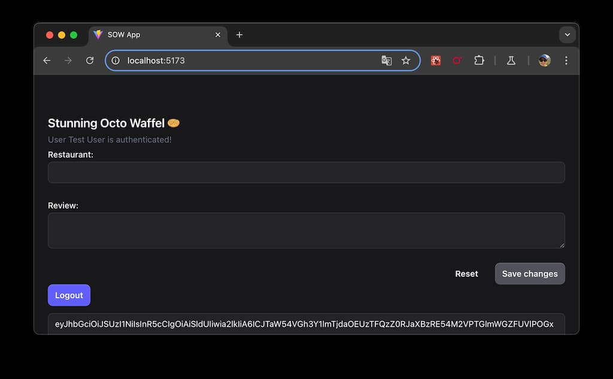

# stunning-octo-waffle
Concept of authentication with Keycloak with Docker




## Running with Docker

To run the application you need to have Docker installed so that you can run the Docker Compose. This will start all the required services of this application.

```bash
docker-compose up --build
```

Open your browser and access the URL: http://localhost:8080 for the Keycloak server.
Login with the user `admin` and password `admin_password`.

Open another tab in your browser and access the URL: http://localhost:3000 for the frontend application.
Login with the user `testuser` and password `testpassword`.

Backend API is available at URL http://localhost:8080/docs

## Keycloak

Well known endpoint: http://localhost:8080/realms/sow/.well-known/openid-configuration
